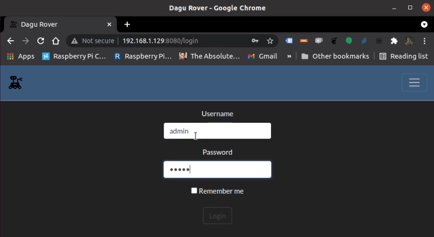

# DaguRoverPi

Python/Flask porting (during my free time) of one of my old java/JSF2 project [RaspDaguRover](https://github.com/francoparodi/RaspiDaguRover) with some improvements as:
* Users handling (stored in SQLlite DB)
* GPS support and GEO data (stored in SQLlite DB)


* **Demo**


The user (after login) can control rover movements, see environment via camera, switch on/off frontal lamp.

* **Login**


* **Cockpit**


* **Users handling**


* **Settings**


* **GPS data**


Lost connection will stop rover.

List of materials used to develop this rover solution:

* **Pololu Dagu Rover (with 4 motors)**


* **Food tapperware**


* **Raspberry Pi 3 B Model**


* **Raspberry Pi Camera V2.1**


* **Raspberry Pi Camera case**


* **Raspberry supply battery (10000mAh Powerbank)**


* **Raspberry switch**


* **Motors supply battery (5000mAh LiPo battery)**


* **4-Channel Motors controller circuit**


* **Motors power switch**


* **Frontal lamp with 3-AAA supply battery**


* **Relè to power on-off frontal lamp**


* **GPS Module**


**Connection schema**


## Prerequisites
* [Motion](https://motion-project.github.io/) 3rd party software to stream camera content, and the camera module. 

* GPS Module NEO6M. 

**Quick start** (maybe on Debian-like distro):

***Motion***

installation:
```sh
sudo apt install motion
```

configuration:
```sh
sudo nano /etc/motion/motion.conf
```

start:
```sh
sudo motion
```

logs:
```sh
tail -f /var/log/motion
```

Look for motion_sample.conf in this project.

***GPS NEO6M Module***

Append to /boot/config.txt following code lines:

```sh
dtparam=spi=on
dtoverlay=pi3-disable-bt
core_freq=250
enable_uart=1
force_turbo=1
```

Modify /boot/cmdline.txt to turn off UART as a serial console (due Raspbian behaviour):
```sh
sudo cp /boot/cmdline.txt /boot/cmdline_backup.txt
sudo nano /boot/cmdline.txt
```

WARNING: replace content of cmdline.txt with following but **don't change** old "root" (/dev value) value:
```sh
dwc_otg.lpm_enable=0 console=tty1 root=/dev/mmcblk0p2 rootfstype=ext4 elevator=deadline fsck.repair=yes rootwait quiet splash plymouth.ignore-serial-consoles
```

reboot

Wait some minute to blue led blinking on GPS Module, the run:

```sh
sudo cat /dev/ttyAMA0

```
and verify data.

Now, found which port point to serial port:
```sh
ls -l /dev
```

if output is:
```sh
serial0 -> ttyAMA0
serial1 -> ttyS0
```

we need to execute:
```sh
sudo systemctl stop serial-getty@ttyAMA0.service
sudo systemctl disable serial-getty@ttyAMA0.service
```

otherwise if output is:
```sh
serial0 -> ttyS0
serial1 -> ttyAMA0
```

we need to execute:
```sh
sudo systemctl stop serial-getty@ttyS0.service
sudo systemctl disable serial-getty@ttyS0.service
```

To test GPS hardware is properly working, run script 'gps_hw_test.py', it should show something like:
```sh
(venv) pi@raspberrypi:~/DaguRoverPi/flaskr $ python3 gps_hw_test.py 
Time=18:22:35 Satellites=06 GPSQuality=1 Altitude=256.5M Latitude=N,4536.22335 Longitude=E,00957.96886
Time=18:22:36 Satellites=06 GPSQuality=1 Altitude=256.5M Latitude=N,4536.22331 Longitude=E,00957.96868
Time=18:22:37 Satellites=06 GPSQuality=1 Altitude=256.5M Latitude=N,4536.22329 Longitude=E,00957.96858
Time=18:22:38 Satellites=06 GPSQuality=1 Altitude=256.4M Latitude=N,4536.22328 Longitude=E,00957.96857
Time=18:22:39 Satellites=06 GPSQuality=1 Altitude=256.3M Latitude=N,4536.22330 Longitude=E,00957.96862
Time=18:22:40 Satellites=06 GPSQuality=1 Altitude=256.2M Latitude=N,4536.22334 Longitude=E,00957.96867
Time=18:22:41 Satellites=06 GPSQuality=1 Altitude=255.9M Latitude=N,4536.22340 Longitude=E,00957.96875
Time=18:22:42 Satellites=06 GPSQuality=1 Altitude=255.7M Latitude=N,4536.22345 Longitude=E,00957.96885
```

## Installing

From the project root:
```sh
python3 -m venv venv
source venv/bin/activate
pip install -r requirements.txt
python3 init-db.py
```
Init DB process will create two users:

**admin** (pwd: admin role: ADMIN - can handle users)

**user** (pwd: user role: USER - cannot handle users)

## Running

__remember to run motion to stream cam data:__
```sh
sudo motion &
```

__run as app:__

```sh
export FLASK_APP=flaskr
flask run
```

__run as wsgi server:__

```sh
waitress-serve --host localhost --port 8080 --call 'flaskr:create_app'
```
or
```sh
gunicorn --worker-class eventlet -w 1 -b localhost:8080 wsgi
```

## Deployment

As seen above (gunicorn, waitress...)

## TODO:
* [ ] Allow lamp to be switched on/off.
* [ ] IRsensor to automatically avoid obstacles.
* [ ] Use only one LiPo battery for both Raspberry and motors (introduce 7V to 5V voltage converter).
* [ ] Improve aquiring satellites speed.
* [ ] Add night vision camera.
* [ ] Update/Re-Design connection schema.

## Authors 

Franco Parodi <franco.parodi@aol.com>

## License

This project is licensed under the MIT License